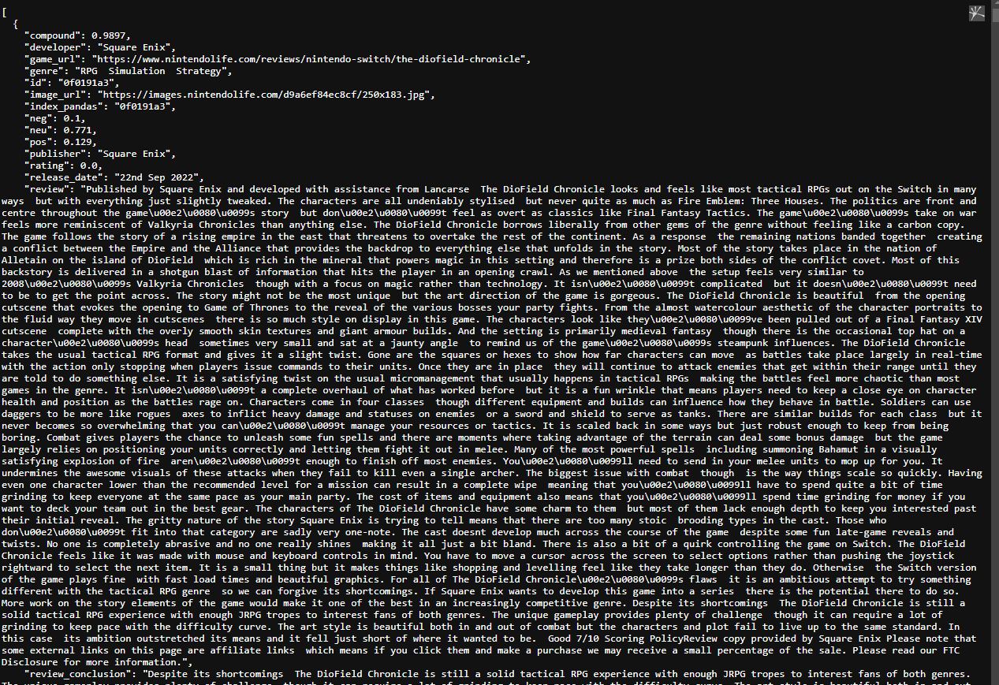
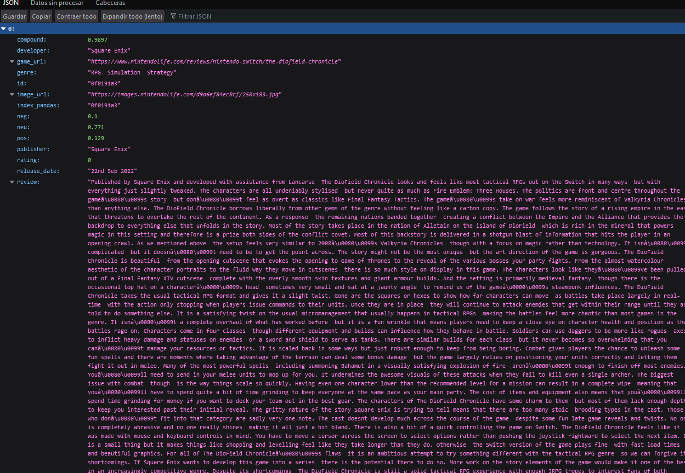
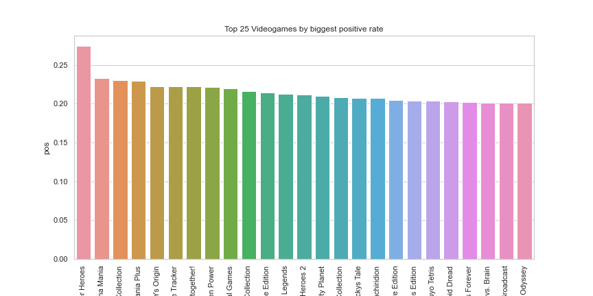

# Nintendo Switch Videogames Sentiment Review

## Objective
As part of our fourth project in the Data Analytics bootcamp, we have been tasked the following objectives:

1) Find or create a database with reviews, comments, actual text where we can do some sentiment analysis using the different methods we have learned in class

2) Upload the final database we end up with to MySQL Workbench

3) Create Python functions that run SQL queries in order to serve the data we want to see

4) Create an API through Flask and use our terminal and the functions we created so we can practice some "get" and some "post" requests as if we wanted to access our own API as a external user - i.e. understand how the API works from inside

## Database chosen

The database that has been used for this project is a public database from [Kaggle](https://www.kaggle.com/datasets/giovanni60310/nintendo-switch-games-reviews) about Nintendo Switch videogames and the official review about each of them that has been done by [Nintendo Life Reviews](https://www.nintendolife.com/reviews).

This is what the database looks like:

## Data cleaning & Sentiment Analysis

The database itself was pretty clean already, but some extra data that was not very useful for this project has been removed in order to make the final output simpler.

With regards to the sentiment analysis, the Sentiment Intensity Analyzer (sia) from Vader has been applied to all the videogames reviews in order to get how positive, negative, neutral as well as the compound of each game review is.

This is an example of what the final database with the sentiment analysis included looks like:

After defining a function that returns us the WordCloud of a given videogame review, we can see the following as an example for the videogame Super Bomberman R:

## Uploading the database into MySQL

Once we have got all the data to use for this project, we were tasked to upload this information to MySQL so we can self-serve the data as much as we want.

There were some barriers to this part of the process given the way the information was initially collated vs. the requirements from MySQL to get all the information in a specific format, but after some challenges the information was uploaded properly! This is an example of what the database looked like in MySQL:

## Python functions running SQL queries

Now that the data is also available in MySQL, I decided to run some SQL queries through Python - by establishing the connection to SQL accordingly - so I could serve the SQL data in Python. An example of one of the functions I used would be the following:

## API creation

Once the queries have been created, I did set up an API using Flask through my own terminal so I could test whether the API could work publicly - as long as you have access to it - and that all the queries that were initially created in Python could be executed by external users if accessing the API with the right accesses.

The way the data is visualised in both Google Chrome and Mozilla Firefox is slightly different, so the following two screenshots are just showing the differences:

If accessing the API via Chrome:

If accessing the API via Firefox:

The way external users could access this - test - API is the following:

a) Get actual access to the API / url by requesting access to the url (in my case the internal server)

b) Read the documentation: see below for some examples of data retrieved using different endpoints within the API),  so users know what information this API can retrieve as well as how they need to access to it by playing with the url (e.g. searching for specific information of a videogame publisher).

c) The list of queries, which include the information users can retrieve, is in the sql_queries.py file

## Using the API: Getting some data as 'users'

| url to follow    | Information retrieved |
| ---------------- | ----------------------|
| url/     | Get the readme for the project/API        |
| url/sql/    | Get everything          |
| url/sql/\<title>    | Get all the info for a given videogame (title is a parameter required)          |
| url/sql/reviews   | All info for those videogames rated more than 7          |
| url//sql/average/by/developer    | Average rating by developer when rating is bigger than 7           |
| url/sql/titles/compound    | All titles with compound bigger than 0.5          |
| url/sql/info/by/positivity    | All info where positivity bigger than 0.2          |
| url/sql/\<year>/launches    | All info for all videogames launched in a given year (year is a parameter required)          |
| url/sql/genre/launches    | Number of titles launched by genre limit 20          |
| url/sql/publisher/launches    | Number of titles launched by publisher          |
| url/sql/info/\<title>    | Info for specific videogame (e.g. Mario, passing a string, title is a parameter required)          |
| url/sql/genre/avgsentiment    | Average negative sentiment by genre TOP 20          |
| url/sql/\<developer>/avginfo    | Key average info by developer (developer is a required parameter)          |
| url/sql/title/keyinfo    | Key info (only) by title         |
| url/sql/keyinfo/\<developer>    | Key title info by specific searched developer (developer is a required parameter)          |
| url/sql/\<developer>/\<year>    | Number of titles launched by searched developer by searched year (developer and year are required parameters)          |
| url/sql/top10/\<year>    | Top 10 games launched in searched year by negativity (year is a required parameter)          |
| POST endpoint: url/insertrow    | Inserting a new row into the database          |

The following visuals have been taken using the above endpoints through Python so the results can be visualised:

A ) Looking at the top 5 developers by Average Rating:

B) Top 25 Videogames by Positive Rate:

C) Number of titles launched by genre - Only top 20

D) Top 20 Genres by Number of videogames launched:

E) Top 5 Publishers by Number of Videogames launched:

F) Key info for Mario videogames:

G) Top 20 Genres by Smaller (more positive) Average Negative Sentiment:

H) Top 20 Genres by Bigger (more negative) Average Negative Sentiment:

I) Getting key average sentiments by specific developer:

J) Number of videogames launched by specific developer (e.g. Square Enix) in a given year (e.g. 2022):

K) Screenshot of what the SQL database looks like once the "POST" request has been executed successfully:

## Conclusions & Learnings

Given the endpoints used above were only used as examples to make the API work, the conclusions for this project are more related to the actual programming:

a) Importance of getting the dataframe as clean and organised as possible before importing it to SQL

b) Once you know the information you can actually access, generate different queries so you can self-serve only the key information you are after

c) API generation: Better understanding of how the actual endpoints work and how external users can do their requests: either get or post information from/to the database

## Key documents/deliverables

a) sql_connection.py

b) sql_queries.py

c) main.py

d) visualisation.py

e) main_database.ipynb

f) connecting_to_sql.ipynb

g) Figures folder